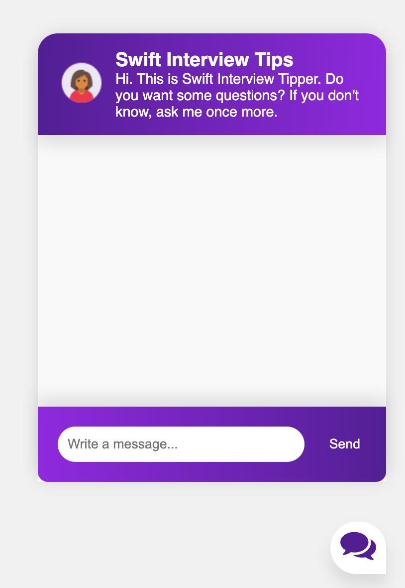
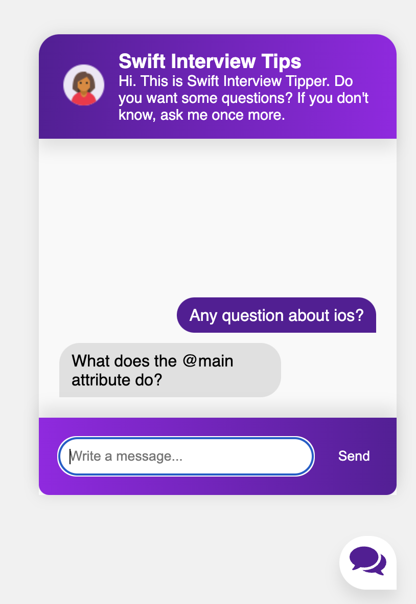
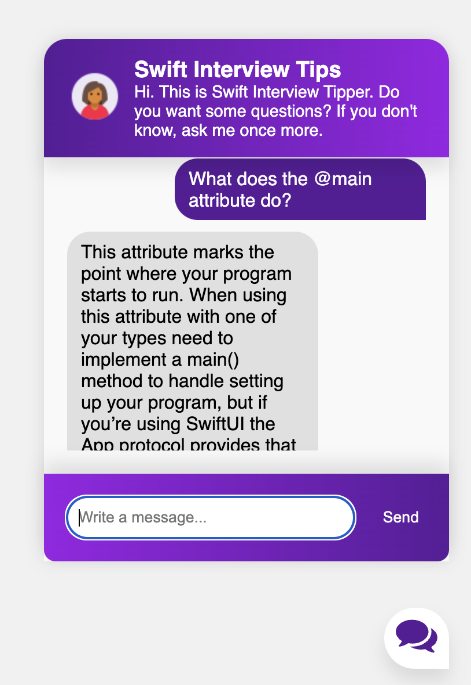
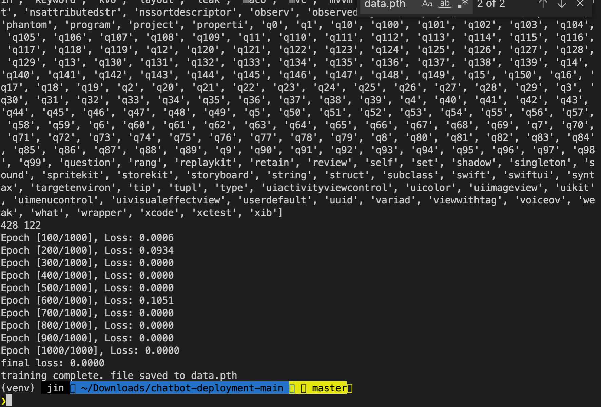

# swift-interview-chatbot

이 봇은 사용자로 swift 개발자에게 중요한 150가지 인터뷰 질문들을 모아 챗봇 형태로 도와줄 수 있도록 설계된 어플리케이션 입니다. 특정 주제에 대한 질문을 던진후, 그 질문을 다시 되물으면 그 질문에 대한 팁을 얻을 수 있습니다.

http://3.39.248.195/ - 이 IP에 현재 배포되어 있는 상태입니다.

## 사용방법


1. 채팅 버튼을 클릭합니다

2. 원하는 주제에 대한 질문을 합니다.

3. 질문을 받습니다.

4. 질문을 되물어 질문에 대한 팁을 받습니다.

### 가상 환경을 만들어 줍니다.

```
$ git clone https://github.com/python-engineer/chatbot-deployment.git
$ cd chatbot-deployment
$ python3 -m venv venv
$ . venv/bin/activate
```

### dependency를 설치해 줍니다.

```
$ (venv) pip install Flask torch torchvision nltk
```

### 학습을 위해 nltk의 punkt를 다운받아 줍니다.

```
$ (venv) python

> > > import nltk
> > > nltk.download('punkt')
```

### 학습을 시킵니다.

```
$ (venv) python train.py
```



### 커멘드 라인에서 예시로 테스트를 해볼 수 있도록 하였습니다.

```
$ (venv) python chat.py
```
